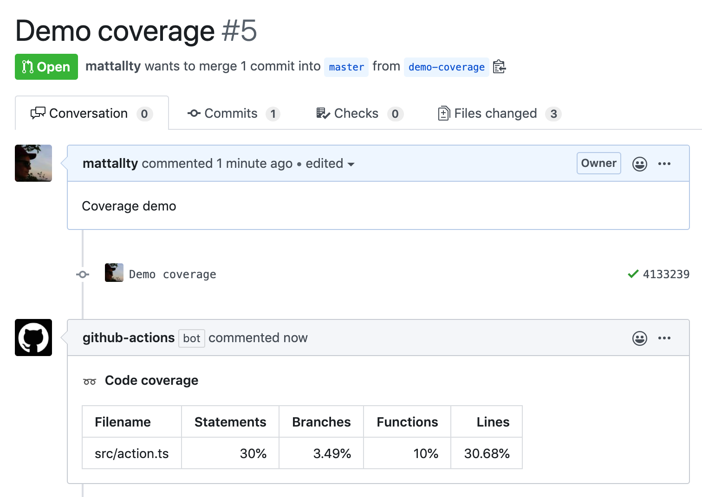
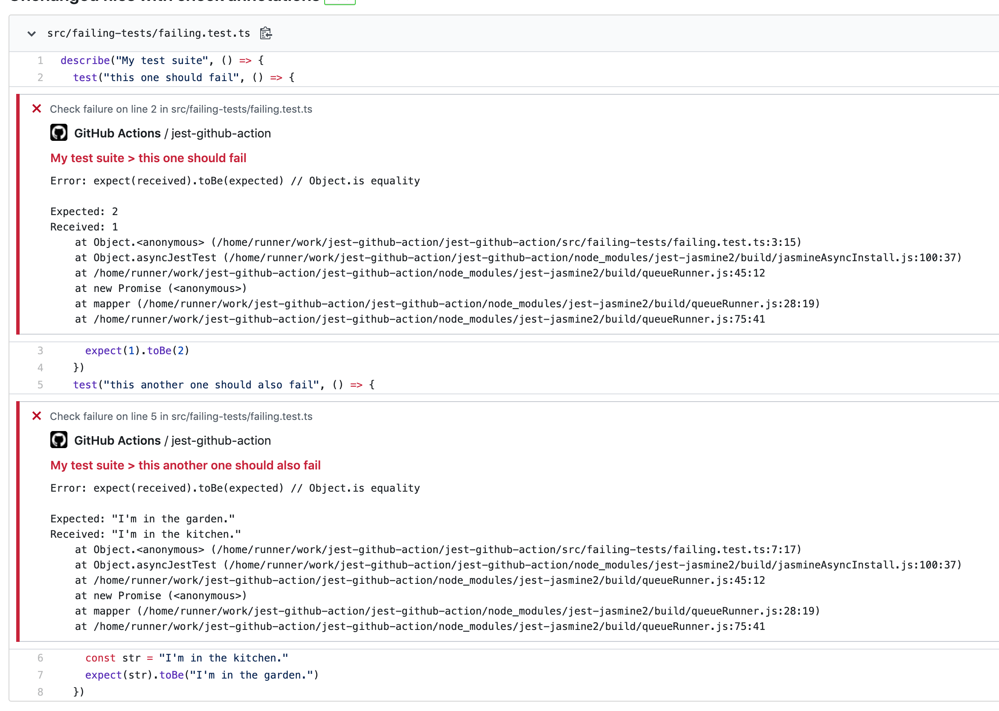

# Jest Github Action

Main features:

- Add status checks with code annotations to your pull requests
- Comment your pull requests with code coverage table (if tests succeeded)

## Coverage example



## Check annotations example



## Usage

You can now consume the action by referencing the v1 branch

```yaml
uses: mattallty/jest-github-action@v1
env:
  GITHUB_TOKEN: ${{ secrets.GITHUB_TOKEN }}
```

### Overriding the test command

By default, this action will execute `npm test` to run your tests.
You can change this behavior by providing a custom `test-command` like this:

```yaml
uses: mattallty/jest-github-action@v1
env:
  GITHUB_TOKEN: ${{ secrets.GITHUB_TOKEN }}
with:
  # this is just an example, this could be any command that will trigger jest
  test-command: "yarn test"
```

### Running tests only on changed files

```yaml
uses: mattallty/jest-github-action@v1
env:
  GITHUB_TOKEN: ${{ secrets.GITHUB_TOKEN }}
with:
  # Runs tests related to the changes since the base branch of your pull request
  # Default to false if not set
  changes-only: true
```

### Silencing the code coverage comment

```yaml
uses: mattallty/jest-github-action@v1
env:
  GITHUB_TOKEN: ${{ secrets.GITHUB_TOKEN }}
with:
  # To avoid reporting code coverage, set this variable to false
  coverage-comment: false
```

### Running tests in a subdirectory

For running tests in folders other than root, supply a working-directory.

```yaml
uses: mattallty/jest-github-action@v1
env:
  GITHUB_TOKEN: ${{ secrets.GITHUB_TOKEN }}
with:
  working-directory: "frontend"
```

### Hide details in coverage comment

```yaml
uses: mattallty/jest-github-action@v1
env:
  GITHUB_TOKEN: ${{ secrets.GITHUB_TOKEN }}
with:
  # To hide details in coverage comment
  hide-details: true
```

See the [actions tab](https://github.com/mattallty/jest-github-action/actions) for runs of this action! :rocket:
